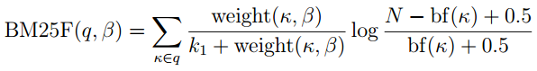
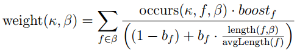
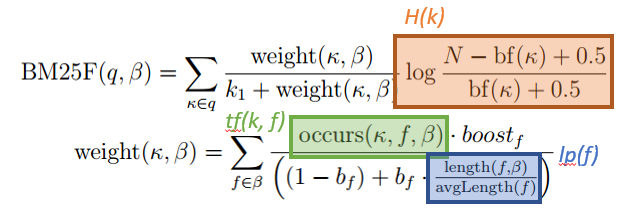

RankLibBM25F-IA
=======

A Learning to Rank Library.

Forked from: jattenberg/RankLib

which is copied from: http://people.cs.umass.edu/~vdang/ranklib.html


Additional Features
===================

## BM25F Ranking Function

The BM25F ranking function is for documents containing multiple fields.
In this context, fields means categorized partial documents.
For example, names, descriptions, and prices are all possible fields of detail pages of merchandises.

The BM25F supports multiple categories of fields and their different weights.
The function is represented by the formula:



where
_q_ is a set of query keywords,
_beta_ is a document (i.e., a set of term occurrences),
_ka_ is a query keyword,
_k1_ is a saturation factor for term frequency,
_N_ is the number of documents in the corpus,
_bf(k)_ is the number of documents in the corpus in which _ka_ occurs.

The score of _beta_ for _ka_ is represented by the other formula:



where occurs(_ka, f, beta_) is the number of occurences of _ka_ in the field _f_ of _beta_,
_boost_f_ is the weight of _f_ relative to the other fields,
_b_f_ is a strength of length-based normalization of _occurs_ in _f_,
_length_ is the length of _f_ in _beta_,
_avgLength_ is the average length of _f_.

Strict sorting of input features is required to use this ranking function.

```concept
/**
 * @author tmanabe
 *
 * This class implements the BM25F model and its optimization with the method known as Coordinate Ascent.
 *
 * You must sort kf + 1 features in the following order where
 * k means |keywords|, f |fields|, tf(i, j) TF of i-th keyword in j-th field,
 * H(i) entropy of i-th keyword, and lp(j) length penalty of j-th field.
 * [k,     H(1),     H(2),     H(3),     ..., H(k),
 *  lp(1), tf(1, 1), tf(2, 1), tf(3, 1), ..., tf(k, 1),
 *  lp(2), tf(1, 2), tf(2, 2), tf(3, 2), ..., tf(k, 2),
 *  lp(3), tf(1, 3), tf(2, 3), tf(3, 3), ..., tf(k, 3),
 *  ...
 *  lp(f), tf(1, f), tf(2, f), tf(3, f), ..., tf(k, f)]
 * Note that H(i) is the (i+1)-th feature,
 * lp(j) the ((k+1)j+1)-th, and tf(i, j) the ((k+1)j+i+1)-th.
 */
```

The `H(k)`, `lp(f)`, and `tf(k, f)` feature values in the above JavaDoc correspond to the partial formulae illustrated below:



Note: Different number of feature values for different query IDs is allowed
because we may at once optimize the rankings for multiple queries with different numbers of keywords.

Use of this ranking function triggers optimization of the _k1_, _b_f_, and _boost_f_ parameters with coordinate ascent.
They are internally used and outputted in this order:

```concept
// [k1, b(1), b(2), b(3), ..., b(f), boost(1), boost(2), boost(3), ..., boost(f)]
// Note that b(j) is the j-th element and also that boost(j) is the (f+j)-th.
```


## SpanF Ranking Function

The SpanF ranking function is a variation of BM25F which considers proximity between keyword occurrences.
The details of the function is in a short note:

https://arxiv.org/pdf/1709.03260

Strict sorting of input features is required to use this ranking function.

```concept
/**
 * @author tmanabe
 *
 * This class implements the Span model proposed by Song et al. [1] then
 * naturally extended for multiple fields by tmanabe [2], and
 * its optimization with the method known as Coordinate Ascent.
 *
 * [1] R. Song, M. J. Taylor, J.-R. Wen, H.-W. Hon, and Y. Yu. Viewing term
 * proximity from a different perspective. In ECIR, pages 346–357, 2008.
 * [2] T. Manabe and S. Fujita. A Short Note on Proximity-based Scoring of
 * Documents with Multiple Fields. CoRR, arXiv:1709.03260, 2017.
 *
 * You must sort features in the following order where
 * k means |keywords|, f |fields|,
 * H(j) the entoropy of j-th keyword,
 * lp(i) the length penalty of i-th field,
 * n(i,j) |spans of i-th field in which j-th keyword occurs|,
 * s(h,i) |keywords occur in the h-th span of i-th field|, and
 * w(h,i,j) the width of h-th span of i-th field in which j-th keyword occurs.
 *
 * [k, f, H(1), H(2), H(3), ..., H(k), lp(1), lp(2), lp(3), ..., lp(f),
 *
 *  n(1,1), s(1,1), w(1,1,1), s(2,1), w(2,1,1), ..., s(n(1,1),1), w(n(1,1),1,1),
 *  n(2,1), s(1,2), w(1,2,1), s(2,2), w(2,2,1), ..., s(n(2,1),2), w(n(2,1),2,1),
 *  n(3,1), s(1,3), w(1,3,1), s(2,3), w(2,3,1), ..., s(n(3,1),3), w(n(3,1),3,1),
 *  ...
 *  n(f,1), s(1,f), w(1,f,1), s(2,f), w(2,f,1), ..., s(n(f,1),f), w(n(f,1),f,1),
 *
 *  n(1,2), s(1,1), w(1,1,2), s(2,1), w(2,1,2), ..., s(n(1,2),1), w(n(1,2),1,2),
 *  n(2,2), s(1,2), w(1,2,2), s(2,2), w(2,2,2), ..., s(n(2,2),2), w(n(2,2),2,2),
 *  n(3,2), s(1,3), w(1,3,2), s(2,3), w(2,3,2), ..., s(n(3,2),3), w(n(3,2),3,2),
 *  ...
 *  n(f,2), s(1,f), w(1,f,2), s(2,f), w(2,f,2), ..., s(n(f,2),f), w(n(f,2),f,2),
 *
 *  n(1,3), s(1,1), w(1,1,3), s(2,1), w(2,1,3), ..., s(n(1,3),1), w(n(1,3),1,3),
 *  n(2,3), s(1,2), w(1,2,3), s(2,2), w(2,2,3), ..., s(n(2,3),2), w(n(2,3),2,3),
 *  n(3,3), s(1,3), w(1,3,3), s(2,3), w(2,3,3), ..., s(n(3,3),3), w(n(3,3),3,3),
 *  ...
 *  n(f,3), s(1,f), w(1,f,3), s(2,f), w(2,f,3), ..., s(n(f,3),f), w(n(f,3),f,3),
 *
 *  ...
 *
 *  n(1,k), s(1,1), w(1,1,k), s(2,1), w(2,1,k), ..., s(n(1,k),1), w(n(1,k),1,k),
 *  n(2,k), s(1,2), w(1,2,k), s(2,2), w(2,2,k), ..., s(n(2,k),2), w(n(2,k),2,k),
 *  n(3,k), s(1,3), w(1,3,k), s(2,3), w(2,3,k), ..., s(n(3,k),3), w(n(3,k),3,k),
 *  ...
 *  n(f,k), s(1,f), w(1,f,k), s(2,f), w(2,f,k), ..., s(n(f,k),f), w(n(f,k),f,k)]
 */
```

Use of this ranking function triggers optimization of the _k1_, _z_f_, _x_f_, _b_f_, and _boost_f_ parameters with coordinate ascent.
They are internally used and outputted in this order:

```concept
/**
 * [k1,
 *  z(1), z(2), z(3), ..., z(f),
 *  x(1), x(2), x(3), ..., x(f),
 *  b(1), b(2), b(3), ..., b(f),
 *  boost(1), boost(2), boost(3), ..., boost(f)]
 *  Note that z(i) is the i-th element,
 *  that x(i) is the (f+i)-th,
 *  that b(i) is the (2f+i)-th, and
 *  that boost(i) is the (3f+i)-th.
 */
```


## Intent-Aware Labels

Multiple users may have different intents behind a query.
To represent such queries, you can input comma-separated multiple answer labels for each document.
You should align labels for an intent in the same column.

Note: Different number of labels for different query IDs is also allowed.


## MAP-IA Evaluation Measure

The MAP-IA (intent-aware mean average precision) is an evaluation measure for rankings with multiple possible query intents.
This is the weighted summation of MAP scores for multiple intents.
The weights are the probabilities that each intent occurs.

Unfortunately there is no way to input the intent probabilities
so that the current implementation calculates simple arithmetic mean of MAP scores for multiple intents.
In other words, we assume an even intent probabilities of all intents behind each query.


## Multiple Documents Sharing ID

In case there are multiple documents of the same document ID,
only the top-scored one will be outputted.
